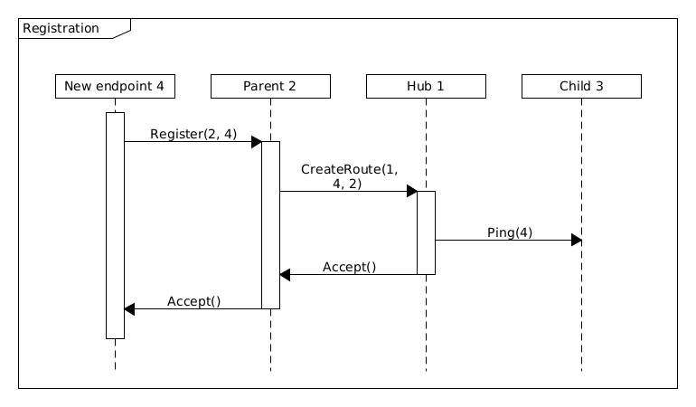
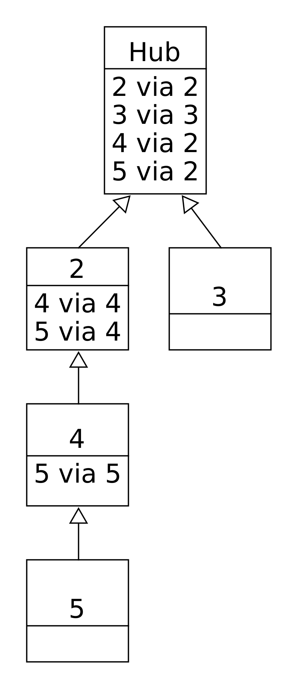

# Network Protocol

This Network Protocol is used for the communication between the central hub and the endpoints.

## IDs

The hub and each endpoint has it's each unique identifier, where the hub has the ID 1. The ID 0 is used for broadcast messages. Also groups can be created and assigned an ID, broadcast to the group ID are received by every endpoint in the group. It is stored in one byte, limiting the number of possible endpoints to 254. Groups have an own address room, where group and endpoint IDs are distinguished by the Group flag. Each member of the network only pays attention to message of it's parents or children and ignores all other messages, that are accidentally received from another member in range. A message has an transmission identifier, to uniquely identify a message between two hops. If the messages is forwarded further, it gets a new ID. Since the transmission ID has only one byte the number of messages, that can be sent without being acknowledged is limited to 256.

## Messages

Each message consists of the following fields:
- 1 Byte: Version
- 1 Byte: Receiver
- 6 Bit: Message Type (max 64 message types)
<a name="GF"></a>
- 1 Bit: Group flag (GF)
<a name="GAF"></a>
- 1 Bit: Group ascending flag (GAF)
- Variable: Message Type specific fields
- 1 Byte: Transmission ID
- 1 Byte: Checksum
- Total of 5 Bytes for the standard meta data

### Commands (0)

Commands are used for exchanging data between the network members. It can consist of a single command or a command with parameters. Commands are stored in one byte, limiting the number of possible commands to 255, while the parameters can have variable data lengths. Each command message package contains its origin and message ID, which are used to identify the message and reconstruct it.\
Additional fields:
- 1 Byte: Command (only for first package)
- 1 Byte: Total packages (only for first package)
- 1 Byte: Package number
- 1 Byte: Origin
- 2 Byte: Message ID
- Variabel: Parameters

The total size of meta data for a command package is 9 Bytes, which leaves 23 bytes per Package as the maximum for a nRF24L01 is 32 bytes. Since there is 1 byte for package numbers, there can be a maximum of 256 packages, 
which means the parameters can have 5 888 - 2 (Command and total packages) = 5 886 bytes at max.

```
void send(byte destination, byte command, byte[] payload)
void sendToGroup(byte destination, byte command, byte[] payload)
```

### Register (1)

Registers an endpoint to the network at startup of the endpoint. See Registration for information.\
Additional fields:
- 1 Byte: ID
- 4 Byte: Temporary ID (timestamp, used if ID is 0)

```
void connect(byte parent)
```

### Accept/Reject (2)

Accepts or rejects the endpoint, that is trying to register.\
Additional fields:
- 1 Byte: Accept (1)/Reject (0)
- 4 Byte: Temporary ID (used if receiver is 0)
Only sent by the protocol.

### Ping (3)

Pings a device.\
Additional fields:
- 1 Byte: Sender
- 1 Byte: Ping ID
- 1 Byte: Is Response
- 4 Byte: Timestamp

```
void ping(byte destination)
```

Represents both ping request and response. The response is marked with the IsResponse field

### Route Creation (4)

Collects all hops to the hub for the new endpoint and writes the new endpoint into the routing list of each hop. The 8 byte meta data limit the route length to 24 and so the tree height to 24+2=26 (hub and lowest endpoints do not need a spot in the route).\
Additional fields:
- 1 Byte: ID of the new endpoint
- 4 Byte: Temporary ID (timestamp, used if ID is 0)
- Variabel: Each Hop to the hub

Only sent by the protocol.

### Add To/Remove From Group (5)

Adds or removes an endpoint to/from a group for broadcasting to a group of specific devices.\
Additional fields:
- 1 Byte: Add (1)/Remove (0) 
- 1 Byte: ID of the group

Can only be done at the interface of the hub, so the message is only sent by the protocol.

### Error (6)

Signals an error, that occurred during another message.\
Additional fields:
- 1 Byte: Error code
- Variable: First 24 byte of original message

This error message is reserved for use by the protocol. For application errors use the command message. All errors are logged at the hop.

### Discover (7)

A new device sends a discover message to find the best parent.\
Additional fields:
- 1 Byte: Request/Answer

Only sent by the protocol.

## Registration

A new endpoint chooses its parent itself. Since the nRF listening is limited to six devices and it has to listen to its parent, the number of children for each device is limited to five. A new endpoint sends a discover message to all possible IDs. Each device, that receives this message, responds with its ID and distance to the root if it has a slot available. The new endpoint chooses the device with the lowest distance and performs a connection quality check by sending 100 pings and measuring the RTT and the response rate. If the quality is less than a certain threshold, the device with the next highest distance is selected and tested. This is done until a device with a good connection is found.

If the endpoint has been registered already or is assigned a static ID, it sends it's ID to the hub or another endpoint, which will be the new endpoint's parent. The parent sends a Route Creation message to the hub. Each hop on the way adds the new endpoint to it's routing list with all previous hops flagged invalid and adds itself to the hop list of the route creation message. The hub pings the ID of the new endpoint to check if the endpoint tries to hijack an ID.
If the ping does not get a response, the registration is accepted and an accept message is sent. Each hop on the way validates the entry in the routing list.\
If the endpoint is registered the first time, it sends a 0 as ID and sets its temporaray ID to the current timestamp. This allows multiple registrations at the same time with a low collision probability. The parent sends a Route Creation message to the hub. Each hop on the way adds the new endpoint to it's routing list with all previous hops flagged invalid and with the temporaray ID and adds itself to the hop list of the route creation message. The hub then assigns the next free ID in an accept message if there is a free ID. Each hop on the way validates the entry and saves the correct ID in the routing list.\


## Routing List

Each Node has a list with all children and via which children they are reachable. It can have invalid entries flagged valid if an endpoint disconnects, since there are no disconnect messages.\


## Groups

Endpoints can be parts of groups to benefit from group broadcasts. A group broadcast is sent with the [GF](#GF) and the [GAF](#GAF) flag set. While the GAF flag is set, all endpoints send the message to their parent. When the messages reaches the hub the GAF flag is reset and sent to all children. Each endpoint picks up the message and sends it to all own children.
